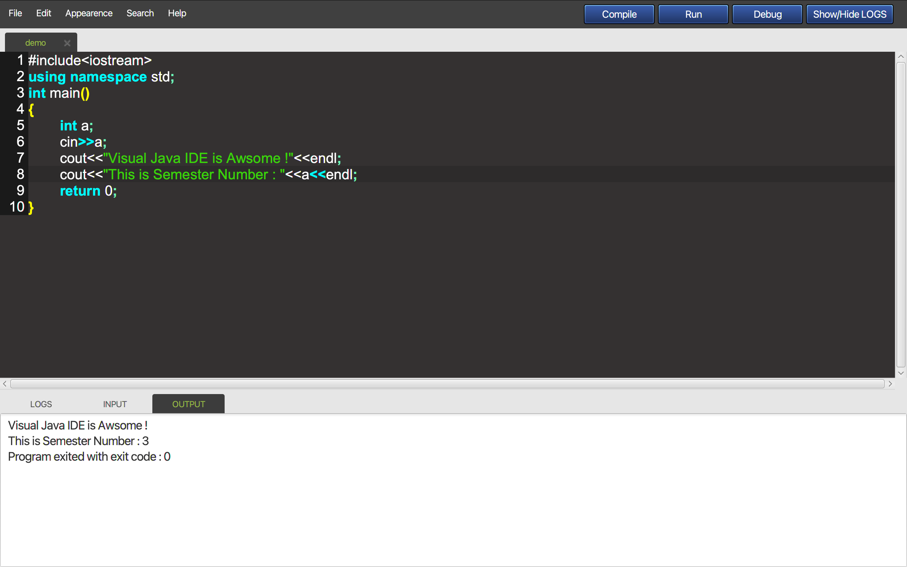
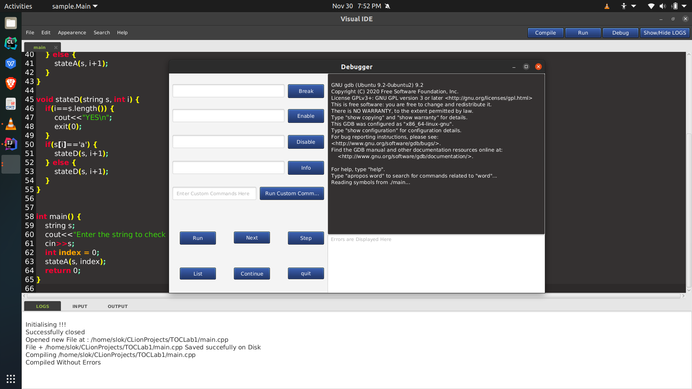

# VisualJavaIDE
___
## Purpose:
Visual Java Editor Project is developed for C++/Java Programmers for editing and debugging C++ Code. There are many editors available in the market, this project is similar to existing project with basic feauture like edit,search,Search & Replace,format,syntax highlighting,run along with a very user friendly U.I. that is very easy to navigate.
___
## Technologies Used:
>1. **Java Language**
>1. **JavaFX Framework**
___
## How to setup ?
>1. **Clone this repository through the following link:**
 ```
https://github.com/phantom654/VisualJavaIDE.git
```
>2. **Add JavaFx Framework to your project. If you are using Intellij IDE then follow this link for guidance :**
[Guide](https://www.jetbrains.com/help/idea/javafx.html)
>3. **Add this Library to your project.**
[Library](https://drive.google.com/file/d/1u2ahA0tqTMTfBYf9fsriEGBaDJBAQytf/view?usp=sharing)
___
## Project Description:
>1. **The application provides an interface to write up your code with ease with the help of very handy features.**
>2. **The application provides features like compiling & running code , search & replace , debugging code and syntax highlighting.**
>3. **Provides utility of code indentation & changing ui appearance.**
>4. **It provides one place access to all the features that are required to write up your basic codes.**
___
## Contributors:
>1. **Sumit Kumar Sahu (IIT2019069)**
>2. **Rajpal Singh Shekhawat (IIT2019061)**
>3. **Slok Aks (IIT2019067)**
>4. **Pranav Singhal (IIT2019050)**
___
## Project Screenshots:
<center></center>
<center></center>
